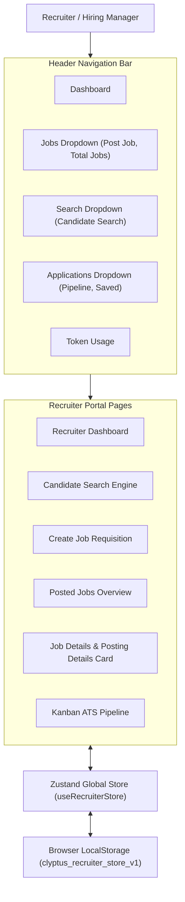
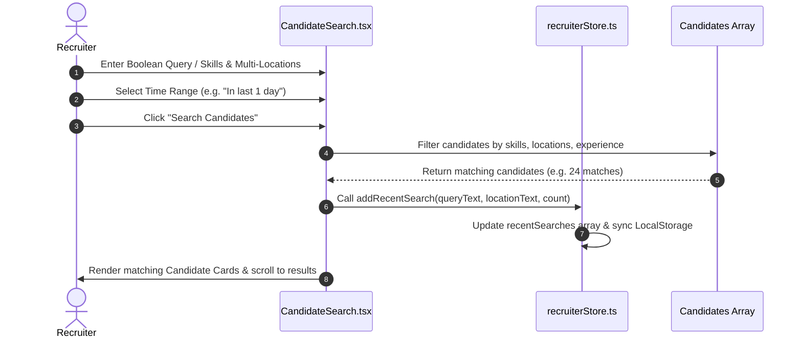

# Clyptus Recruiter Portal - Technical & User Documentation

## 1. Executive Summary

The **Clyptus Recruiter Portal** is an enterprise-grade Employer Talent Acquisition platform designed for high-growth technical hiring teams and staffing agencies. Inspired by modern SaaS platforms such as **Foundit (Monster)** and **Naukri**, the portal combines AI-assisted candidate boolean searching, multi-city location tag filtering, job requisition management, applicant tracking (ATS), and persistent recruiter state management.

Built with a **pure white corporate aesthetic** (`#4F46E5` primary indigo accents, `#0F172A` headings, `#FFFFFF` container backgrounds), the portal delivers an intuitive, fast, and responsive user experience across desktop and mobile devices.

---

## 2. Technology Stack & System Architecture

### 2.1 Core Technologies

| Category | Technology | Usage |
| :--- | :--- | :--- |
| **Frontend Framework** | React 19 + TypeScript | Component-driven UI architecture with strict type safety |
| **Build System** | Vite 8.x | High-performance HMR dev server & bundle optimizer |
| **Styling Engine** | Tailwind CSS | Utility-first responsive styling system |
| **Icon System** | Lucide React | Modern vector iconography |
| **State Management** | Zustand + `persist` middleware | Global application state with automatic `localStorage` persistence |
| **Routing** | React Router v7 | Dynamic parameterized client-side routing (`/org/:organizationId/recruiter/...`) |
| **Source Control** | GitHub | Remote repository (`https://github.com/khaja9963/Recruiter-portal`) |

### 2.2 System Architecture Diagram



---

## 3. Core Features & Functional Overview

### 3.1 Candidate Search Engine (`CandidateSearch.tsx`)

The candidate search module offers recruiters deep filtering capabilities to identify top talent from the Clyptus talent database:

1. **AI Boolean Search Mode:**
   - Toggle switch for **Boolean Search** with `(AI-powered)` indicator.
   - Textarea query editor with live character counter (`0 / 300 characters limit`).
   - `Search in` targeted scope selection (`Profile`, `Resume`, etc.).
   - `Exclude synonyms ⓘ` option for exact keyword matching.

2. **Multi-Location Tag Chips System:**
   - Self-type multi-location chip input (`MapPin` icon chips with removable `X` buttons).
   - Dynamic city suggestions dropdown: **searched/matching cities display FIRST at top** of the list.
   - Options to include relocating candidates and specify alternative preferred work locations.

3. **Experience & Salary Filters:**
   - Experience (Minimum) and Experience (Maximum) dropdowns in **Years only** (no months).
   - Annual Salary (Minimum) and Annual Salary (Maximum) dropdowns in **Lacs** without extraneous text buttons.

4. **Education Qualification Accordion:**
   - Collapsible accordion (`educationOpen`, default `false`).
   - Toggle buttons with **Undo support** for:
     - Under Graduation: `Any UG`, `Specific UG`, `No UG`
     - Post Graduation: `Any PG`, `Specific PG`, `No PG`
     - Doctorate: `Any PhD`, `Specific PhD`, `No PhD`

5. **Employment & Additional Details Accordions:**
   - Collapsible Employment accordion (`employmentOpen`, default `false`) with 2-column Industry/Sub-industry category browser and Company filter.
   - Collapsible Additional Details accordion (`additionalDetailsOpen`, default `false`) containing `Gender` and `Visa status` options.

6. **Show Only & Active Time Range Filters:**
   - `Unseen profiles`, `Profiles with verified email-id`, `Profiles with verified mobile no.`, `Profiles with resume`.
   - Time range filter dropdown (`In last 1 day`, `In last 3 days`, `In last 7 days`, `In last 15 days`, `In last 1 month`, `In last 3 months`, `In last 6 months`) positioned directly underneath **Show only**.

---

### 3.2 Create Job Requisition (`CreateJob.tsx`)

The job creation workflow allows hiring managers to construct and publish new job postings:

1. **Sticky Posting Details Panel:**
   - Left-hand **Posting details** panel remains sticky (`lg:sticky lg:top-20 lg:self-start`) on scroll for immediate visibility into category, schedule, and expiry settings.

2. **Self-Type Multi-Location Job Location Input:**
   - Multi-location tag chips system for job locations with popover suggestion list.

3. **Blank Form State:**
   - Form fields start 100% empty with no pre-filled default data.

4. **Custom Questionnaire:**
   - Toggleable screening question constructor for candidate applications.

---

### 3.3 Top Header Navigation (`RecruiterHeader.tsx`)

1. **Top Navbar Structure:**
   - **Dashboard**: Direct link placed in front of `Jobs`.
   - **Jobs**: Dropdown containing *Post a Job* and *Total Jobs Posted*.
   - **Search**: Dropdown containing *Candidate Search*.
   - **Applications**: Dropdown containing *Candidate Pipeline* and *Saved Candidate Profiles*.
   - **Token Usage**: Direct link placed after `Applications`.

2. **Streamlined Right Controls:**
   - Recruiter user avatar dropdown with settings and sign-out options.

---

### 3.4 Job View & Posting Details (`JobDetails.tsx`)

Clicking the view (`Eye`) icon on any posted job opens the detailed view page featuring a dedicated **Job Posting Details** card containing:
- **Job Title & Requisition ID**
- **Department**
- **Job Location & Work Mode**
- **Employment Type & Experience Range**
- **Annual Salary Range (in Lacs)**
- **Number of Openings**
- **Notice Period & Education Level**
- **Assigned Recruiter & Posted Date**

---

### 3.5 State Persistence Across Page Reloads (`recruiterStore.ts`)

All application state is wrapped with Zustand's `persist` middleware:
- **Key**: `clyptus_recruiter_store_v1`
- **Behavior**: Newly posted jobs, updated ATS application stages, candidate notes, and recent candidate searches persist across browser page reloads (`F5`) without resetting to initial defaults.

---

## 4. Candidate Search Workflow



---

## 5. Local Setup & Execution Guide

### 5.1 Prerequisites
- **Node.js**: v18.0.0 or higher
- **npm**: v9.0.0 or higher

### 5.2 Installation & Startup

1. **Clone the Repository:**
   ```bash
   git clone https://github.com/khaja9963/Recruiter-portal.git
   cd Recruiter-portal/frontend
   ```

2. **Install Dependencies:**
   ```bash
   npm install
   ```

3. **Start Local Development Server:**
   ```bash
   npx vite --host 127.0.0.1 --port 5173
   ```

4. **Access the Portal:**
   - **Recruiter Dashboard:** [http://127.0.0.1:5173/org/clyptus/recruiter/dashboard](http://127.0.0.1:5173/org/clyptus/recruiter/dashboard)
   - **Candidate Search:** [http://127.0.0.1:5173/org/clyptus/recruiter/candidates/search](http://127.0.0.1:5173/org/clyptus/recruiter/candidates/search)
   - **Post New Job:** [http://127.0.0.1:5173/org/clyptus/recruiter/jobs/create](http://127.0.0.1:5173/org/clyptus/recruiter/jobs/create)

5. **Type Verification Check:**
   ```bash
   npx tsc --noEmit
   ```

---

## 6. Remote Repository Synchronization

- **GitHub Remote:** [https://github.com/khaja9963/Recruiter-portal](https://github.com/khaja9963/Recruiter-portal)
- **Primary Branch:** `main`
- **Status:** Fully synchronized & up-to-date with all recent features, persistence fixes, and UI layouts.
